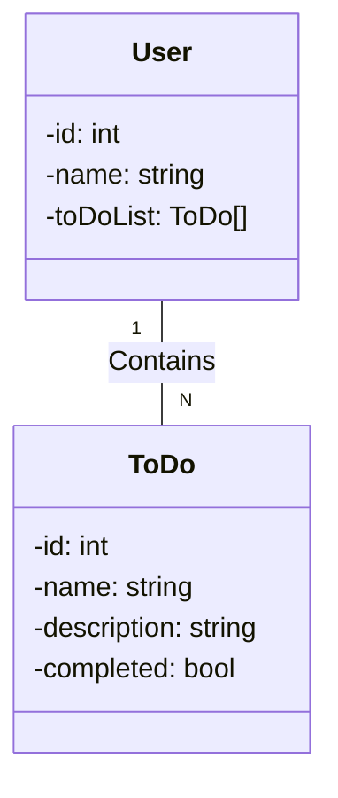

# <h1 align="center">To Do List API com Spring Boot</h1>

### <h3 align="center">API que permite a criação de usuários e lista de tarefas. Projeto desenvolvido para o Desafio de Projeto do Bootcamp Santander na trilha Java + Angular Fullstack</h3>

 

 

## Features
- [x] Cadastro, atualização de usuários
- [x] Ao remover um usuário também se remove a sua lista de tarefas
- [x] Cadastro, atualização e remoção de tarefas
- [x] Tarefas podem ser marcadas como concluídas ou não

 

## Deploy na nuvem
O projeto está disponível para ser testado na nuvem através do Railway que também está provisionando um banco de dados PostgresSQL para salvar os dados.

[O projeto pode ser acessado aqui.](https://todo-app-prd.up.railway.app/swagger-ui/index.html#/)

 

## Diagrama de Classes

